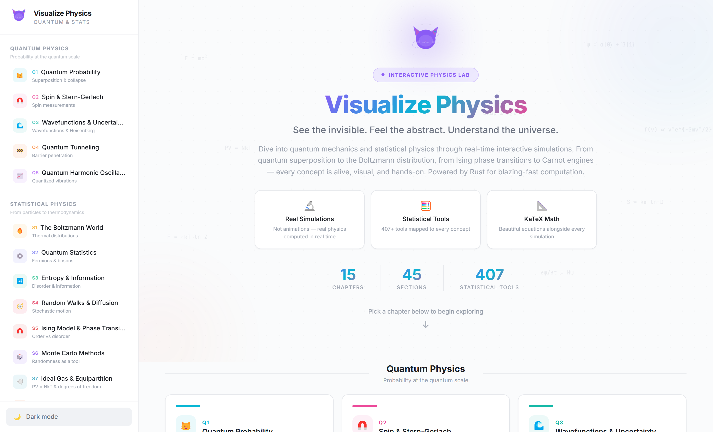
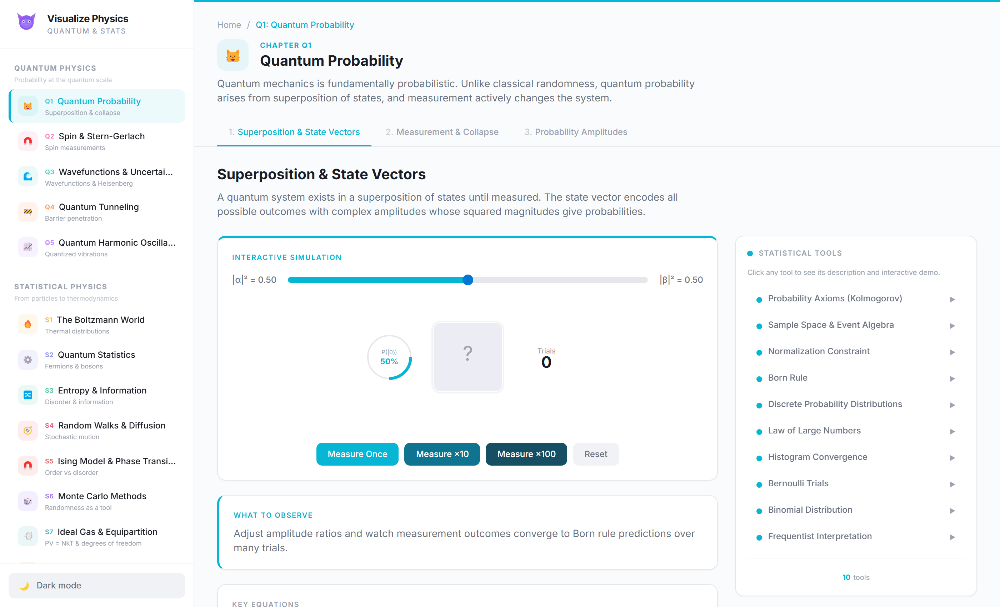
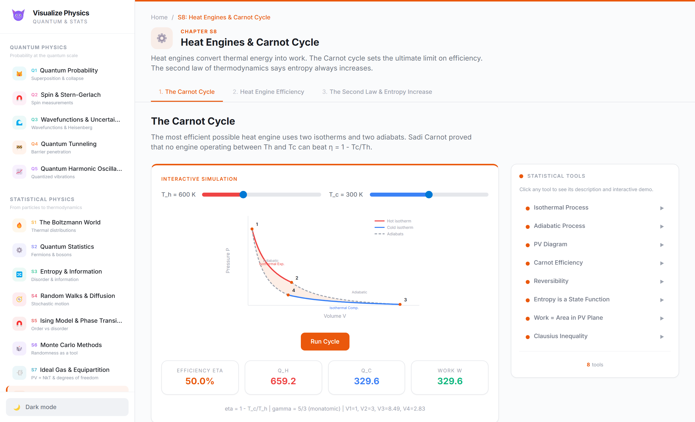
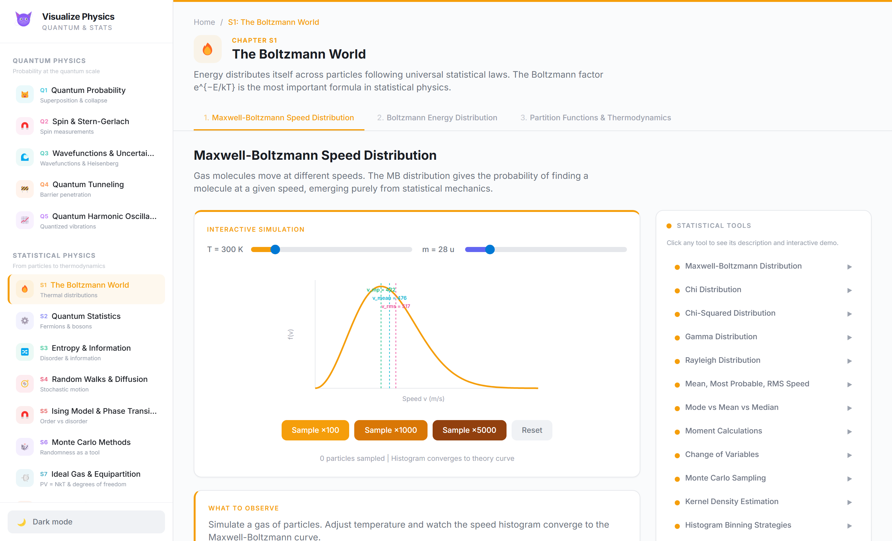
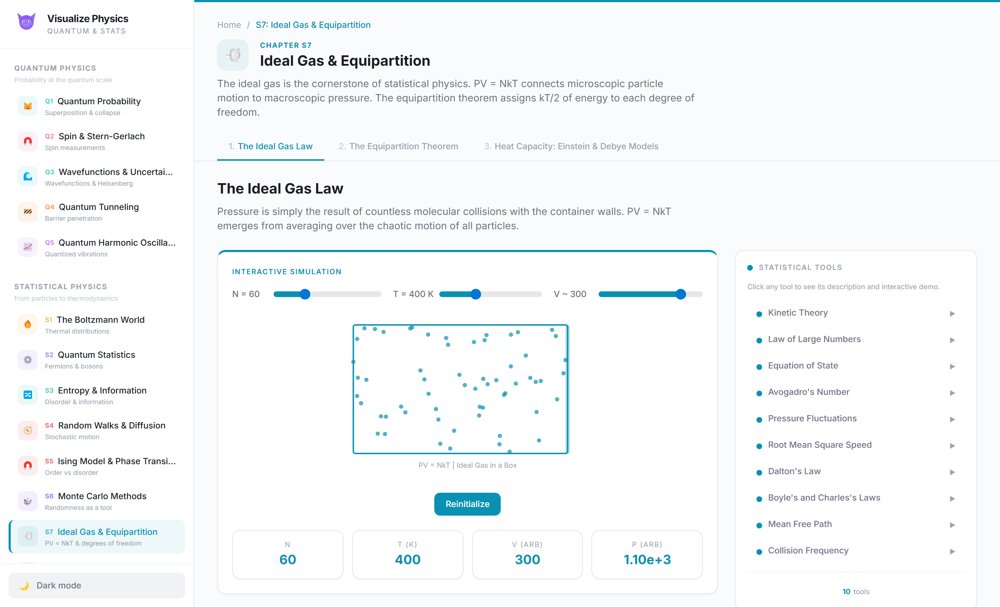
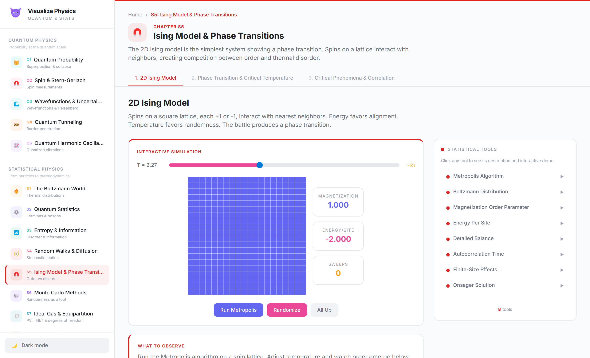
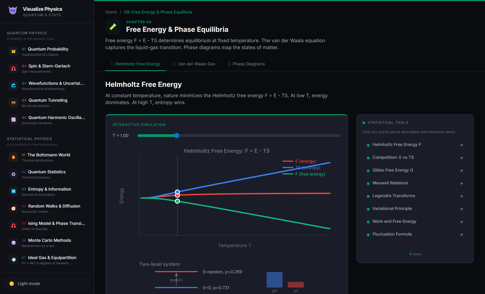
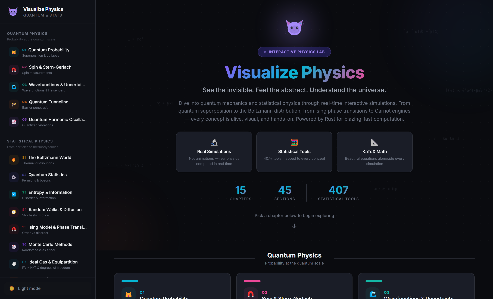

<div align="center">


# Visualize Physics

### A Visual Introduction to Quantum & Statistical Physics

**See the invisible. Feel the abstract. Understand the universe.**

[](https://github.com/hasnain7abbas/visualize-physics/releases)
[](https://tauri.app)
[](https://www.rust-lang.org)
[](https://www.solidjs.com)

[](https://github.com/hasnain7abbas/visualize-physics/releases)
[](LICENSE)
[](https://github.com/hasnain7abbas/visualize-physics/stargazers)
[](https://hasnain7abbas.github.io/visualize-physics/)

[Try Online](https://hasnain7abbas.github.io/visualize-physics/) · [Download](#-download) · [Features](#-features) · [Chapters](#-chapters) · [Contributing](#-contributing)

---

</div>

## Screenshots

<div align="center">

### Welcome Screen


### Interactive Simulations
<p>


</p>
<p>


</p>
<p>


</p>

### Dark Mode


</div>

---

## Features

- **30+ Interactive Simulations** — Every section has a working, hands-on visualization
- **407+ Statistical Tools** — Exhaustive coverage from Born rule to Shannon entropy, each with expandable explanations and mini-simulations
- **Beautiful Math** — KaTeX-rendered equations that look like a textbook
- **Dark & Light Mode** — Easy on the eyes, any time of day
- **Rust-Powered Backend** — High-performance computation via Tauri
- **Native Desktop App** — Runs offline with .exe and .msi installers
- **Web Version** — Try it instantly at [hasnain7abbas.github.io/visualize-physics](https://hasnain7abbas.github.io/visualize-physics/)
- **Polished UI** — Color-coded chapters, smooth animations, floating equations, intuitive navigation

---

## Chapters

The app is organized into **two major sections** with **15 chapters**, **45 interactive sections**, and **407+ statistical tools**:

### Quantum Physics

| Chapter | Topics | Highlights |
|---------|--------|------------|
| **Q1 — Quantum Probability** | Superposition · Measurement & Collapse · Probability Amplitudes | Born Rule, Bernoulli Trials, Interference, Markov Chains |
| **Q2 — Spin & Stern-Gerlach** | Single SG · Sequential SG · Expectation Values | Binomial Distribution, Hypothesis Testing, MLE |
| **Q3 — Wavefunctions** | Particle in a Box · Wavepackets · Heisenberg Uncertainty | Fourier Transforms, Fisher Information, Cramér-Rao |
| **Q4 — Quantum Tunneling** | Barrier Penetration · Alpha Decay · Resonant Tunneling | WKB, Gamow Factor, Breit-Wigner, Survival Analysis |
| **Q5 — Harmonic Oscillator** | Energy Levels · Coherent States · Zero-Point Energy | Hermite Polynomials, Poisson Distribution, Planck Distribution |

### Statistical Physics

| Chapter | Topics | Highlights |
|---------|--------|------------|
| **S1 — The Boltzmann World** | Maxwell-Boltzmann · Boltzmann Energy · Partition Functions | Chi/Gamma Distributions, Metropolis-Hastings, Equipartition |
| **S2 — Quantum Statistics** | Fermions vs Bosons · Fermi-Dirac · Bose-Einstein | Combinatorics, Polylogarithms, Grand Canonical Ensemble |
| **S3 — Entropy & Information** | Microstates · Entropy of Mixing · Shannon/Gibbs Entropy | KL Divergence, Mutual Information, Landauer's Principle |
| **S4 — Random Walks** | 1D Walk · 2D Brownian Motion · Diffusion Equation | CLT, Wiener Process, Levy Flights, Einstein Relation |
| **S5 — Ising Model** | 2D Ising · Phase Transition · Critical Phenomena | Metropolis Algorithm, Critical Exponents, Renormalization Group |
| **S6 — Monte Carlo Methods** | Estimating pi · MC Integration · MCMC | Importance Sampling, Gibbs Sampling, Convergence Diagnostics |
| **S7 — Ideal Gas & Equipartition** | Ideal Gas Law · Equipartition Theorem · Heat Capacity | Kinetic Theory, Degrees of Freedom, Einstein/Debye Models |
| **S8 — Heat Engines & Carnot** | Carnot Cycle · Engine Efficiency · Second Law | PV Diagrams, Carnot Efficiency, Clausius Inequality |
| **S9 — Free Energy & Phases** | Helmholtz Free Energy · Van der Waals · Phase Diagrams | Maxwell Construction, Critical Point, Clausius-Clapeyron |
| **S10 — Fluctuations & Response** | Energy Fluctuations · Fluctuation-Dissipation · Brownian Motion | Langevin Equation, Johnson-Nyquist Noise, Green-Kubo Relations |

---

## Simulations

Every section has a **fully interactive simulation**, and every statistical tool has its own **mini-simulation** when clicked:

| Simulation | Description |
|------------|-------------|
| **Quantum Superposition** | Adjust amplitudes, measure qubits, watch histogram converge to Born rule |
| **Stern-Gerlach Chain** | Build Z-X-Z sequences, see information destruction in action |
| **Quantum Tunneling** | Watch wavefunctions decay inside barriers, adjust height/width |
| **Ideal Gas** | Animated particles bouncing in a container, PV = NkT in real time |
| **Carnot Cycle** | Animated PV diagram with isotherms and adiabats, live efficiency |
| **Maxwell-Boltzmann** | Sample particle speeds, histogram converges to theory curve |
| **2D Ising Model** | Run Metropolis on a spin lattice, watch order emerge below T_c |
| **Van der Waals** | Explore isotherms, see the Maxwell construction below T_c |
| **Phase Diagram** | Navigate P-T space, cross phase boundaries with visual effects |
| **Brownian Motion** | 2D Langevin trajectory with MSD tracking (Einstein relation) |
| **Fluctuation-Dissipation** | Verify chi = beta * variance(M) for a paramagnet |
| **Monte Carlo pi** | Throw random darts and estimate pi with 1/sqrt(N) convergence |
| **Shannon Entropy** | Drag probability sliders, see H, D_KL, mutual information live |

---

## Download

> **Windows only** (macOS and Linux coming soon)

| File | Description |
|------|-------------|
| [**.msi** Installer](https://github.com/hasnain7abbas/visualize-physics/releases/latest) | Standard Windows installer (recommended) |
| [**.exe** Setup](https://github.com/hasnain7abbas/visualize-physics/releases/latest) | NSIS installer (smaller download) |

Or try the **web version** instantly: [hasnain7abbas.github.io/visualize-physics](https://hasnain7abbas.github.io/visualize-physics/)

Or build from source:

```bash
# Prerequisites: Node.js 18+, Rust 1.70+, Tauri CLI
git clone https://github.com/hasnain7abbas/visualize-physics.git
cd visualize-physics
npm install
npm run tauri build
```

---

## Tech Stack

<div align="center">

| Layer | Technology | Role |
|-------|-----------|------|
| **Framework** | [Tauri 2](https://tauri.app) | Native desktop shell, security, packaging |
| **Backend** | [Rust](https://rust-lang.org) | Physics computations, RNG, statistics |
| **Frontend** | [SolidJS](https://solidjs.com) | Fine-grained reactive UI |
| **Styling** | [Tailwind CSS](https://tailwindcss.com) | Utility-first styling |
| **Math** | [KaTeX](https://katex.org) | LaTeX equation rendering |
| **Build** | [Vite 6](https://vitejs.dev) | Sub-second HMR, fast builds |

</div>

### Key Rust Dependencies

```toml
statrs = "0.17"       # Statistical distributions
rand = "0.8"          # Random number generation
num-complex = "0.4"   # Complex numbers for wavefunctions
nalgebra = "0.33"     # Linear algebra
```

---

## Roadmap

- [x] 15 chapters with 45 interactive sections
- [x] 407+ statistical tools with descriptions and mini-simulations
- [x] KaTeX math rendering
- [x] Dark/Light theme
- [x] Welcome hero with floating equations
- [x] Windows .exe and .msi installers
- [x] GitHub Pages web deployment
- [x] Statistical physics foundations (Ideal Gas, Carnot, Free Energy, Fluctuations)
- [ ] D3.js advanced visualizations (scatter plots, heatmaps)
- [ ] Rust-powered Monte Carlo backends for all simulations
- [ ] macOS and Linux builds
- [ ] Bloch sphere 3D visualization
- [ ] Phase space plots
- [ ] Export simulation data as CSV
- [ ] Localization (i18n)

---

## Contributing

Contributions are welcome! Whether it's:

- Bug reports
- Feature suggestions
- UI/UX improvements
- Documentation
- New simulations

Please open an [issue](https://github.com/hasnain7abbas/visualize-physics/issues) or submit a PR.

---

## About

<div align="center">

**Made with passion by [Hasnain Abbas](mailto:hsnanrzee1160@gmail.com)**

Transforming abstract quantum mechanics and statistical physics into playful, hands-on simulations — because if you can see it, you can understand it.

*Inspired by [Seeing Theory](https://seeing-theory.brown.edu/) by Daniel Kunin, Brown University.*
*Non-commercial educational project.*

</div>

---

<div align="center">

If you find this useful, please consider giving it a star!

[](https://star-history.com/#hasnain7abbas/visualize-physics&Date)

</div>
